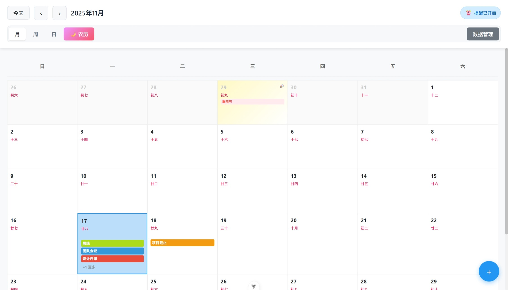
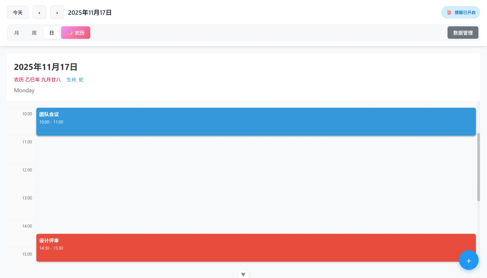
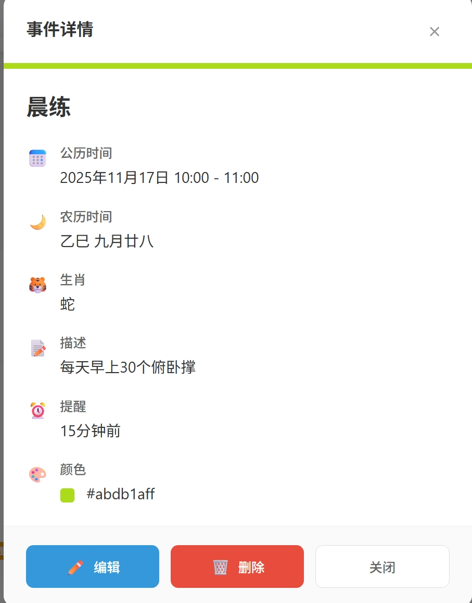
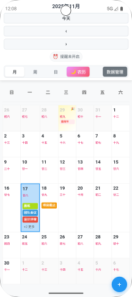

# 日历应用 (Calendar App)

## 项目简介

基于 Vue 3 + Vite 开发的现代化日历应用，支持多视图展示、完整日程管理、提醒功能、数据导入导出及农历显示，可通过 Capacitor 跨端部署至 Android。
### 相关页面展示
- 主页（月）视图:

- 日视图：

- 事件查看：

- 移动端展示：

更多展示请前往[show文件夹](./show/)查看

## 核心功能

### 基础功能

- **多视图展示**：月视图（网格布局）、周视图（时间轴）、日视图（详细时间槽），支持视图快速切换
- **日程管理**：
  - 添加：自定义标题、描述、时间、颜色分类及提醒设置
  - 编辑/查看：修改已有日程或查看详情（含农历信息）
  - 删除：带确认机制的安全删除

### 扩展功能

- **日程提醒**：基于浏览器通知 API，支持提前 15 分钟、30 分钟、1 小时等多时段提醒
- **数据管理**：支持 JSON 格式导入导出，便于数据备份与迁移
- **农历显示**：月/日视图中展示农历日期、节气及节日信息

## 技术栈

- 框架：Vue 3（Composition API）、Pinia（状态管理）
- 工具：Vite（构建）、date-fns（日期处理）
- 跨端：Capacitor（Web 转原生应用）

## 快速开始

1. **环境要求**：Node.js 16+
2. **安装依赖**：`npm install`
3. **开发模式**：`npm run dev`（本地预览，默认地址 `http://localhost:5173`）
4. **构建生产版**：`npm run build`（输出至 `dist` 目录）

## 使用指南

- **视图切换**：通过顶部标签在月/周/日视图间切换，点击日期可快速跳转至日视图
- **农历开关**：点击"农历/公历"按钮切换农历显示状态
- **日程操作**：
  - 新增：点击右下角"+"按钮或时间槽，填写表单提交
  - 编辑/删除：在日程详情中点击对应按钮操作
- **数据管理**：点击"数据管理"，支持导出备份、导入恢复或清除数据
- **提醒设置**：添加/编辑日程时选择提醒时段，首次使用需授权浏览器通知权限

## 跨端部署（Android）

1. 安装 Android Studio（含 SDK）及 Java JDK 17
2. 构建 Web 资源：`npm run build`
3. 同步至 Android 项目：`npx cap sync android`
4. 打开项目：`npx cap open android`（在 Android Studio 中配置应用信息）
5. 运行/打包：选择设备运行或通过 `Build > Build APK(s)` 生成安装包

## 后续计划

- 云端数据同步与多设备协作
- iCalendar 标准格式支持
- 插件化功能扩展

## 许可证

MIT 许可证  
**版本**：v1.0.0
